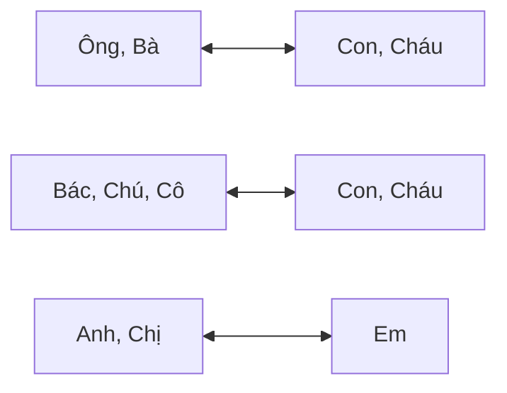

# Vietnamese micro-lessons

## Typing letters and tones

Letters are typed by combining characters.

- `ă`: aw
- `â`: aa
- `ê`: ee
- `ô`: oo
- `ơ`: ow
- `ư`: uw

Tones are to type after all letters. The system decides where it should be. Press z to remove tone.

- `á`: a
- `à`: a
- `ả`: a
- `ã`: a
- `ạ`: a

## Questions

3 types of questions:

- With question words: how, where, why, etc. we answer by replacing the question word by the answer word. No order change, except for Tại sao.
- Yes/no questions: when we are 50% sure of the answer.
- Tag questions: when we are 80% sure and need confirmation.

### Type 1: with question words

- `Bao nhiêu`: How much. Usually comes before a noun. For prices, it often comes at the end. In casual speech, people often shorten to `nhiêu`.
    - `Cái này bao nhiêu tiền?`: How much is this?
    - `Ở đây có bao nhiêu người?`: How many people are here?
- `Mấy`: How much (expected<10)
    - `Con mấy tuổi?`: How old are you children?
    - `Mấy giờ?`: What time?
    - `Mấy tiếng?`: How much time?
    - `Mấy tiền?`: How much money?
- `Tại sao…`: Why
- `Tại sao (subject) lại (verb) ?`: Why with emphasis on curiosity. Answer : `vì` (casual), `tại vì` (negative: to blame), `bởi vì`.
- `Thế nào`: how / what…like, to ask about feelings, quality, condition. `Sao` is more casual and spoken.
    - `Quán này sao?`: How is this place?
    - `Thế nào rồi?`: How’s it going?
- `Ở đâu`: Where (location)
    - `Quê em ở đâu?`: Where is your hometown?
- `Đâu`: Where, used with moving verbs (`đi`, `đến`) and why is it not there.
    - `Bánh mì đâu?`: Why is the bánh mì not there ?
- `Khi nào` / `Bao giờ`: When (in the beginning to ask about the future, or at the end to ask about the past).
- `Thế nào`: How
- `…làm sao để?`: How to do something 
- `Gi`: What
    - `Cái gì`: for objects
    - `Bạn tên là gì?`: What is your name?
    - `Cái này là gì?`: What is this?
- `Nào`: Which
    - `Em thích cái nào?`: Which one do you like?
- `Ai`: Who
- `Bao xa`: How far
- `Bao lâu`: How long
    - `Từ Đà Nẵng đấ Hội An bao xa?`: From Da Nang to Hoi An how far ?
    - `Hội An cách Đà Nẵng bao xa ?`: Hoi An away from Da Nang how far ?

### Type 2: yes/no 50% sure

- `có… không?`: for verbs and adjectives (no `là`). In casual speech, `có` is often omitted.
    - Answered by repeating the verb or adjective for a "yes," and use `không` + verb/adjective for a "no."
    - `Chị (có) bận không?`: Are you busy? *Yes: `Bận` / No: `Không bận`.*
    - `Em (có) hiểu không?`: Do you understand?
- `có phải là... không?`: Used to ask if something or someone belongs to a category, identity or label.
    - `Anh có phải là giáo viên không?`: Are you a teacher?
    - `Chị ấy có phải là người Nhật không?`: Is she Japanese?
- `đã… (verb) chưa?`: yes/no for the past. Answered by `rồi` (yes) or `chưa` (no).

### Type 3: confirmation (isn't it) 80% sure

- `…đúng không`: more conversational. Answered by `Đúng rồi`.
- `…không`
- `…phải không `: slightly more careful or formal.
    - Answered by `Đúng rồi`, `Phải rồi`, `Dạ` (polite).
- `…à`: more casual.
- `…hả?`: most common casual.

## Đi, Đến, Lên, Xuống, Ra, Vào (Moving verbs)

- `Đi`: going
- `Đến`: arriving
- `Lên`: going up 
- `Xuống`: going down
- `Ra`: exit
- `Vào`: enter

## You

- `Ông`, `Bà`: Grandparents generation
- `Bác`: Older than parents
- `Chú`, `Cô`: Younger than parents
- `Anh`, `Chị`: Older than you
- `Bạn`: Same age
- `Em`: Younger than you
- `Con`: Much younger than you

## Là (Is)

`Là` links a subject to:

- identity
- profession
- nationality
- category or label

Used with nouns, not usually with adjectives or most verbs.

`Mình là Vanessa.`: I am Vanessa.

`Tên mình là Hằng.`: My name is Hằng.

`Anh ấy là bác sĩ.`: He is a doctor.

But:

- `Tôi mệt.` (NOT là mệt)
- `Cô ấy đẹp.` (NOT là đẹp)

## Còn vs Và (While/But vs And)

`Và` means “and”. `Còn` often changes topics or creates contrast. `Nhung` is like `còn` but creates more contrast. `Nhung mà` makes it softer.

- `Scott là người Úc, và Marie là người Pháp.`: Scott is Australian, and Marie is French.
- `Phương thích ăn bún bò, còn Nam thì không.`: Phương likes bún bò, but Nam doesn’t.
- `Em là người Nga. Còn anh?`: I’m Russian. What about you?

## Ấy / Đó (That person)

Vietnamese often refers to people using family-style pronouns plus `ấy` or `đó`. `Ấy` is preferred to `đó`, which is a bit rude. `Nó` is used for children, animals or objects, and can sound rude for adults.

- `Anh ấy`: He / That guy
- `Chị ấy`: She / That woman
- `Cô đó`: That woman / That auntie

## Đây / Đó / Kia / Này (This / That)

Used to point at people, things or places.

- `đây`: near the speaker
- `đó`: farther away or already mentioned
- `kia`: clearly far away
- `này`: comes after a noun to mean “this”

- `Đây là bạn mình`.: This is my friend.
- `Đó là nhà mình.`: That is my house.
- `Kia là bà Tám.`: That over there is bà Tám.
- `Cái này ngon.`: This one is delicious.

## Chúng tôi / Chúng ta / Tụi mình (We)

`Chúng tôi` does NOT include the listener. `Chúng ta` includes the listener. `Tụi mình` and `chúng mình` are casual and often include the listener depending on context.

`Chúng tôi học tiếng Việt.` We learn Vietnamese.

`Chúng ta gặp ở đâu?`: Where should we meet?

`Tụi anh là người Anh. Còn em?`: We’re British. What about you?

## Rất / Lắm / Quá (Very)

- `Rất ngon`: informative, used after the experience and usually comes before adjectives and some verbs.
- `Ngon lắm`: more emotional, used after the experience and usually comes at the end.
- `Ngon quá`: used during the experience and comes at the end.
- `Quá ngon`: refers to a past experience, means “too much” and is negative.
- `Ngon vãi`: “freaking tasty”, is for close relatives only.
- `Ngon ghê`: “terrific”.
- `Ngon nhức nách`: “so cool”. Literally “hurts my armpits”.

`Rất ngon!`, `Ngon lắm!`
Very delicious!

`Mình rất thích bánh mì.`
I really like bánh mì.

`Mình nhớ Việt Nam lắm.`
I miss Vietnam a lot.

`Cảm ơn rất nhiều.`, `Cảm ơn nhiều lắm.`
Thank you very much.

## Numbers

- 10: `mười`
- 100: `trăm`
- 1000: `nghìn`
- 1.000.000: `triệu`

In casual speech:

`ba mươi lăm` → `ba lăm`

## Rưỡi / Nửa (Half)

- 150: `một trăm năm mươi` = `một trăm rưỡi`
- 2 500: `hai nghìn rưỡi`
- 3 500 000: `ba triệu rưỡi`
- 1h30min: `một tiếng rưỡi`
- 30min: `nửa tiếng`
- 1:30 am: `một giờ rưỡi`

## Đây / Giờ mình phải… (I’ll do it now / Now I must…)

Sometimes Vietnamese uses short expressions to announce an action.

- `Ăn đây!`: I’m going to eat now!
- `Em ngủ đây`.: I’m going to sleep now.

These are often used:

- before leaving
- to end a conversation
- to announce immediate action

`Giờ mình phải…` means “now I have to…”

`Giờ mình phải đi rồi.`: I have to go now.

## Cho / Để (For / In order to)

`Cho` is used with people or things. `Để` is used before a verb to express purpose.

`Món quà này cho mẹ.`: This gift is for mom.

`Tôi học tiếng Việt để nói chuyện với bạn bè.`: I study Vietnamese to talk with friends.

## Chưa and Rồi (Not yet, Already)

`Anh đã mua cháo chưa?`: Have you bought porridge yet ?

`Anh chưa (mua cháo).`: I haven't bought porridge yet.

`Anh mua (cháo) rồi.`: I have bought porridge already.

## Nêu (If)

`Nêu… thì… nếu không thì…`: If… then… if not…

`Nêu Fanny đói thì Anh mua cháo cho em ấy.`: If Fanny is sick I buy porridge for her.

## Trong khi, Trong lúc, Lúc (While)

- Formal: `Trong khi… (thì)…`
- Less formal: `Trong lúc…`
- Lesser formal: `Lúc…`

`Trong khi anh đang học tiếng Việt thì Fanny nghỉ ngơi.`: While I am learning Vietnamese, Fanny is resting.

## Mặc dù (Even tho)

`Mặc dù… nhưng…`: Even tho… but…

`Mặc dù trời nắng nhưng nhiều người vẫn đi biển.`: Although it is sunny, many people still go to the beach.

## Nhiều, Những, Các (Some, Many, All)

- `Nhiều`: many, undefined.
- `Những`: many, refers to a limited defined group.
- `Các`: refers to everyone.
- `Nhiều học sinh`: some students, undefined category.
- `Những học sinh`: many students but must precise which ones (by age or nationality or else).
- `Các học sinh`: all the students.
